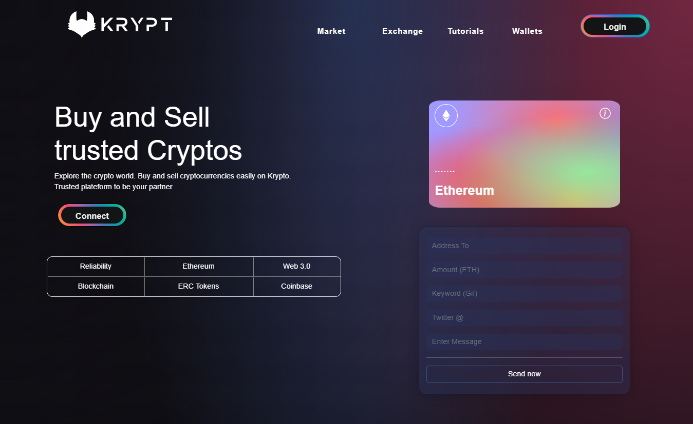

# Web 3.0 Blockchain Application

# Description
**### This Dapp wil provide you a utility to make crypto (Ethereum) transactions. You can send gifs and custom messages with transaction. This dapp will also show records of latest  as well old transactions made by an account through a smart contract.**

# Technologies

 - Solidity (smart contract).
 - React.js (frontend).
 - Ethers.js (contract interaction).
 - Hardhat (contract deployement and local blockchain).

 

